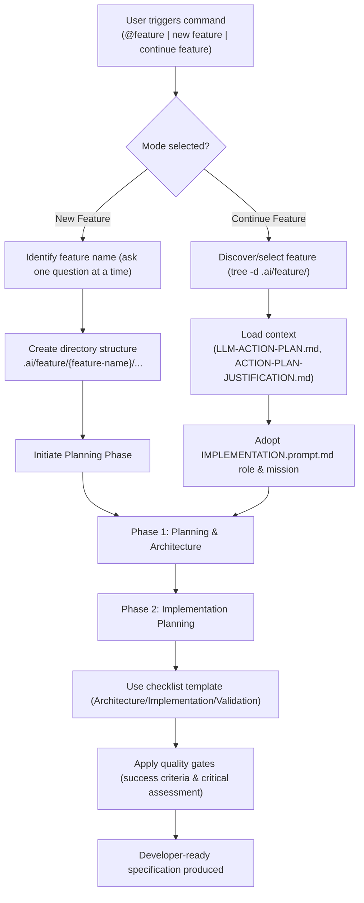
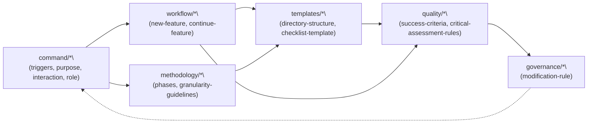

# Feature Command Spec

This abstraction modularizes the feature planning command into focused documents for reuse and maintenance. It is derived from `.ai/thembad/feature/start-feature.md` and split by function: command triggers and purpose, workflows, methodology, templates, quality gates, and governance.

## Structure

- command/
  - triggers.md
  - purpose.md
  - interaction-protocol.md
  - role-persona.md
- workflow/
  - new-feature.md
  - continue-feature.md
- templates/
  - directory-structure.md
  - checklist-template.md
- methodology/
  - phases.md
  - granularity-guidelines.md
- quality/
  - success-criteria.md
  - critical-assessment-rules.md
- governance/
  - modification-rule.md

## How to use

- Start here to understand responsibilities and navigate to the relevant module.
- Combine `workflow/*` with `templates/*` to run a new feature or continue an existing one.
- Apply `methodology/*` to guide planning and implementation.
- Enforce `quality/*` before declaring work complete.
- Follow `governance/modification-rule.md` when evolving the system.

## Origin

Source: `.ai/thembad/feature/start-feature.md` split into cohesive modules to enable clarity, reuse, and future automation (schema/CLI).

## Diagrams

### System Flow

### Module Interactions

